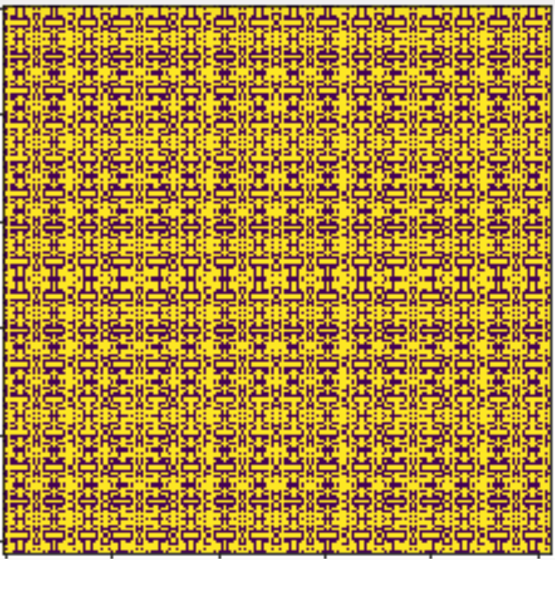

## Μέρος 1ο. Regular expressions

### Άσκηση 1

Γράψτε **ένα** regular expression το οποίο θα εξάγει όλα τα κομμάτια του κειμένου τα οποία βρίσκονται μεταξύ δύο αριθμών.  
Για παράδειγμα:

```
228djj21  --> ['djj']
421   a  d dd8 --> ['   a  d dd']
abcdefg --> []
fdsd2342dfdf --> []
abcd123defg456kkk777 --> [defg, kkk]
```

### Άσκηση 2
Γράψτε **ένα** regular expression το οποίο θα μπορεί να εντοπίζει ελληνικά κινητά τηλέφωνα. Θα πρέπει να εντοπίζει μέσα σε ένα κείμενο τηλέφωνα όπως:

```
6912345678
00306912345678
+306912345678
```
ΔΕΝ θα πρέπει να εντοπίζει τηλέφωνα όπως:

```
691234567 # Δεν έχει 10 ψηφία
7912345678 # Δεν αρχίζει από 69
+316912345678 # Ο διεθνής κωδικός της Ελλάδας δεν είναι το +31 (είναι το +30)
00316912345678 # Ο διεθνής κωδικός της Ελλάδας δεν είναι το +31 (είναι το +30)
```

### Άσκηση 3
Ο αριθμός [ΑΜΚΑ]((https://www.amka.gr/tieinai.html) αποτελείται από έντεκα (11) αριθμούς και αναλύεται ως κάτωθι:
* Πχ ΑΜΚΑ=18076020025 
* Οι έξι πρώτοι αριθμοί αποτελούν την ημερομηνία γέννησης πχ  180760
* Οι τρείς επόμενοι αποτελούν αριθμούς που δίδει η μηχανογράφηση 
* Ο δέκατος είναι η ένδειξη του φύλου (1=ανδρας , 2=γυναίκα) οι ζυγοί αριθμοί 0,2,4,6,8 δίδονται στις γυναίκες ενώ οι μονοί αριθμοί 1,3,5,7,9 στους άνδρες. 
* Ο τελευταίος (5) είναι [αντικώδικας](https://el.wikipedia.org/wiki/%CE%91%CE%BB%CE%B3%CF%8C%CF%81%CE%B9%CE%B8%CE%BC%CE%BF%CF%82_%CF%84%CE%BF%CF%85_%CE%9B%CE%BF%CF%85%CE%BD) 

Φτιάξτε μία συνάρτηση η οποία θα παίρνει ένα AMKA. Αν ο ΑΜΚΑ δεν είναι στο σωστό φορμάτ, θα πετάει exception. 
Θα πρέπει να ελέγχει ότι: (1) η ημερομηνία υπάρχει και ότι (2) το τελευταίο ψηφίο είναι το σωστό. 

H συνάρτηση θα επιστρέφει True αν ανήκει σε γυναίκα και False αν ανήκει σε άντρα.

Tα διάφορα "κομμάτια" του ΑΜΚΑ θα πρέπει να τα παίρνει με regular expressions.

Δίνεται ο παρακάτω κώδικας ο οποίoς ελέγχει αν μία ημερομηνία είναι σωστή ή όχι (επιτρέφει True αν είναι σωστή και False διαφορετικά)

```python
import datetime

def check_date(year, month, day):
	try:
		datetime.datetime(year=year,month=month,day=day)
	except ValueError:
		return False

	return True

check_date(2019, 2, 28) # Επιστρέφει True
check_date(2019, 2, 29) # Επιστρέφει False
```

Δίνεται ο παρακάτω αλγόριθμος ([κλεμμένος από wikipedia](https://el.wikipedia.org/wiki/%CE%91%CE%BB%CE%B3%CF%8C%CF%81%CE%B9%CE%B8%CE%BC%CE%BF%CF%82_%CF%84%CE%BF%CF%85_%CE%9B%CE%BF%CF%85%CE%BD)) ο οποίος ελέγχει αν το τελευταίο ψηφίο του AMKA είναι το σωστό:

```python
def luhn_checksum(card_number):
    def digits_of(n):
        return [int(d) for d in str(n)]
    digits = digits_of(card_number)
    odd_digits = digits[-1::-2]
    even_digits = digits[-2::-2]
    checksum = sum(odd_digits)
    for d in even_digits:
        checksum += sum(digits_of(d*2))
    return checksum % 10

def is_luhn_valid(card_number):
    return luhn_checksum(card_number) == 0

print (18076020025) # Επιστρέφει True
print (18076020026) # Επιστρέφει False
```

### Άσκηση 4
Οι ελληνικές πινακίδες στα Ι.Χ οχήματα έχουν 2 ή 3 γράμματα ακολουθούμενα από 4 αριθμούς. Τα γράμματα που επιτρέπονται είναι τα Α,Β,Ε,Ζ,Η,Ι,Κ,Μ,Ν,Ο,Ρ,Τ,Υ,Χ (αυτά δηλαδή που υπάρχουν λατινικά αντίστοιχα). Επίσης ο 4ψήφιος αριθμός δεν μπορεί να αρχίζει από 0. Γράψτε **ένα** regular expression το οποίο να αναγνωρίζει αν ένα string περιέχει μία ελληνική πινακίδα. Χρησιμοποιήστε μόνο λατινικούς χαρακτήρες.

π.χ.
```
HPK1234 # OK
HRK0123 # NOT OK 
HCT1234 # NOT OK
HR12345 # NOT OK
HT1234 # OK 
ΗΡΚ12345 # ΝΟΤ ΟΚ
```

### Άσκηση 5
Στο παρακάτω κείμενο βρείτε με ένα regular expression, όλα τα strings που αρχίζουμε με ```$``` και τλειώνου με ```$```

```latex
We try to quantitatively capture these characteristics by defining a set of indexes, which can be computed using the mosaic image and the corresponding ground truth:
\begin{itemize}
    \item $\mu_{A_T}$ and $\sigma_{A_T}$, the mean and standard deviation of the tiles area $A_T$, respectively;
    \item $\rho_\text{filler}$, the ratio between the filler area and the overall mosaic are, computed as $\rho_\text{filler}=\frac{\sum_{T \in \mathcal{T} A_T}}{A}$, being $A$ the area of the mosaic;
    \item \todo{does it worth?};
    \item \todo{does it worth?};
    \item $\mu_{C_T}$, the mean of the tiles \emph{color dispersion} $C_T$, being $C_T = \sigma_R+\sigma_G+\sigma_B$, where $\sigma_R$, $\sigma_G$ and $\sigma_B$ are the standard deviation of the red, green and blue channel values of the pixels within the tile $T$.
After applying a method to an image, we compare the segmented image (i.e., the result) against the ground truth and assess the performance according to the following three metrics:
\begin{itemize}
    \item average tile precision $P$
    \item average tile recall $R$
    \item tile count error $C$
\end{itemize}
Let $T$ be a tile on the ground truth $\mathcal{T}$ with area $A_T$.
Let $T'$ be the tile in the segmented image which mostly overlaps $T$ and let $A_{T'}$ be the area of $T$; let $A_{T \cap T'}$ be the overlapping area between $T$ and $T'$.
Let $n$ and $n'$ the number of tiles respectively in the ground truth and in the segmented image.
Metrics are defined as:
\begin{align}
    P &amp;= \frac{1}{n} \sum_{T \in \mathcal{T}} \frac{A_{T \cap T'}}{A_{T'}} \\
    R &amp;= \frac{1}{n} \sum_{T \in \mathcal{T}} \frac{A_{T \cap T'}}{A_T} \\
    C &amp;= \frac{|n-n'|}{n}
\end{align}
We try to quantitatively capture these characteristics by defining a set of indexes, which can be computed using the mosaic image and the corresponding ground truth:
\begin{itemize}
    \item $\mu_{A_T}$ and $\sigma_{A_T}$, the mean and standard deviation of the tiles area $A_T$, respectively;
    \item $\rho_\text{filler}$, the ratio between the filler area and the overall mosaic are, computed as $\rho_\text{filler}=\frac{\sum_{T \in \mathcal{T} A_T}}{A}$, being $A$ the area of the mosaic;
    \item \todo{does it worth?};
    \item \todo{does it worth?};
    \item $\mu_{C_T}$, the mean of the tiles \emph{color dispersion} $C_T$, being $C_T = \sigma_R+\sigma_G+\sigma_B$, where $\sigma_R$, $\sigma_G$ and $\sigma_B$ are the standard deviation of the red, green and blue channel values of the pixels within the tile $T$.
After applying a method to an image, we compare the segmented image (i.e., the result) against the ground truth and assess the performance according to the following three metrics:
\begin{itemize}
    \item average tile precision $P$
    \item average tile recall $R$
    \item tile count error $C$
\end{itemize}
Let $T$ be a tile on the ground truth $\mathcal{T}$ with area $A_T$.
Let $T'$ be the tile in the segmented image which mostly overlaps $T$ and let $A_{T'}$ be the area of $T$; let $A_{T \cap T'}$ be the overlapping area between $T$ and $T'$.
Let $n$ and $n'$ the number of tiles respectively in the ground truth and in the segmented image.
Metrics are defined as:
\begin{align}
    P &amp;= \frac{1}{n} \sum_{T \in \mathcal{T}} \frac{A_{T \cap T'}}{A_{T'}} \\
    R &amp;= \frac{1}{n} \sum_{T \in \mathcal{T}} \frac{A_{T \cap T'}}{A_T} \\
    C &amp;= \frac{|n-n'|}{n}
\end{align}
```

Δίνεται η απάντηση:
```python
['$\\mu_{A_T}$',
 '$\\sigma_{A_T}$',
 '$A_T$',
 '$\rho_\text{filler}$',
 '$\rho_\text{filler}=\x0crac{\\sum_{T \\in \\mathcal{T} A_T}}{A}$',
 '$A$',
 '$\\mu_{C_T}$',
 '$C_T$',
 '$C_T = \\sigma_R+\\sigma_G+\\sigma_B$',
 '$\\sigma_R$',
 '$\\sigma_G$',
 '$\\sigma_B$',
 '$T$',
 '$P$',
 '$R$',
 '$C$',
 '$T$',
 '$\\mathcal{T}$',
 '$A_T$',
 "$T'$",
 '$T$',
 "$A_{T'}$",
 '$T$',
 "$A_{T \\cap T'}$",
 '$T$',
 "$T'$",
 '$n$',
 "$n'$",
 '$\\mu_{A_T}$',
 '$\\sigma_{A_T}$',
 '$A_T$',
 '$\rho_\text{filler}$',
 '$\rho_\text{filler}=\x0crac{\\sum_{T \\in \\mathcal{T} A_T}}{A}$',
 '$A$',
 '$\\mu_{C_T}$',
 '$C_T$',
 '$C_T = \\sigma_R+\\sigma_G+\\sigma_B$',
 '$\\sigma_R$',
 '$\\sigma_G$',
 '$\\sigma_B$',
 '$T$',
 '$P$',
 '$R$',
 '$C$',
 '$T$',
 '$\\mathcal{T}$',
 '$A_T$',
 "$T'$",
 '$T$',
 "$A_{T'}$",
 '$T$',
 "$A_{T \\cap T'}$",
 '$T$',
 "$T'$",
 '$n$',
 "$n'$"]
```

### Άσκηση 6
Γράψτε ένα regular expression το οποίο θα αναγνωρίζει filenames από αρχεία εικόνας. Αρχεία εικόνας θεωρούμε αυτά που τελειώνουν σε .jpg .png και .png. Επίσης θα πρέπει να εξάγει το όνομα του αρχείου (με τη group(1)) και τη κατάληξη του αρχείου (με group(2)).

Π.χ:
```
.bash_profile # Δεν κάνει match
workspace.doc # Δεν κάνει match
img0912.jpg # group(1)--> 'img0912', group(2) --> 'jpg'
updated_img0912.png # group(1)--> 'updated_img0912', group(2) --> 'png'
documentation.html # Δεν κάνει match
favicon.gif # group(1)--> 'favicon', group(2) --> 'gif'
img0912.jpg.tmp # Δεν κάνει match
```

## Μέρος 2ο, Κλάσεις

### Άσκηση 7
Γράξτε μία κλάση η οποία αναπαριστάει μία περιοχή στο ανθρώπινο γονιδίωμα. Μία περιοχή ορίζεται από το χρωμόσωμα, τη θέση του νουκλεοτιδίου που αρχίζει και τη θέση του νουκλεοτιδίου που τελείωνει. Θα πρέπει να μπορώ να γράψω:

```python
p = Position('chr5', start=10000, end=10001)
```

Θα πρέπει να ελέγχει ότι το χρωμόσωμα δεν μπορεί να πάρει άλλες τιμές εκτώς από chr1, chr2, ... chr22, X, Y ή ΜΤ (μιτοχονδριακό). 
Επίσης θα πρέπει να ελέγχει ότι το start και end δεν είναι έξω από τα όρια των μεγεθών των χρωμοσωμάτων. Δίνονται παρακάτω τα [μεγέθη των χρωμοσωμάτων σύμφωνα με την έκδοση hg19 του ανθρώπινου γωνιδιώματος](http://hgdownload.cse.ucsc.edu/goldenPath/hg19/bigZips/hg19.chrom.sizes):

```python
sizes = {
        'chr1':    249250621,
        'chr2':    243199373,
        'chr3':    198022430,
        'chr4':    191154276,
        'chr5':    180915260,
        'chr6':    171115067,
        'chr7':    159138663,
        'chrX':    155270560,
        'chr8':    146364022,
        'chr9':    141213431,
        'chr10':   135534747,
        'chr11':   135006516,
        'chr12':   133851895,
        'chr13':   115169878,
        'chr14':   107349540,
        'chr15':   102531392,
        'chr16':   90354753,
        'chr17':   81195210,
        'chr18':   78077248,
        'chr20':   63025520,
        'chrY' :   59373566,
        'chr19':   59128983,
        'chr22':   51304566,
        'chr21':   48129895,
        'chrMT' :   16571,
    }
``` 

### Άσκηση 8
(συνεχίζουμε την άσκηση 7)

Προσθέστε τη static methdod, check_position η οποία θα παίρνει ένα χρωμόσωμα και μία νουκλεοτιδική θέση και θα επιστρέφει True/False ανάλογα με το αν η θέση υπάρχει. Θα πρέπει να μπορώ να γράφω:
```python
Position.check_size('chr22', 10000000) # True
Position.check_size('chr22', 60000000) # False
Position.check_size('Mitsos', 10000000) # False
Position.check_size('chr22', -100) # False
```

### Άσκηση 9
(συνεχίζουμε την άσκηση 8)
Προσθέστε τις μεθόδους __str__() και __len__(), η πρώτη θα τυπώνει το χρωμόσωμα, την αρχή και το τέλος της θέσης και η δεύτερη θα τυπώνει το ```end-start```. Θα πρέπει δηλαδή να μπορώ να γράφω:

```python
p = Position('chr5', start=10000, end=10010)
print (p) # Τυπώνει: `chr5, 10000-10010`
print (len(p)) # Τυπώνει 10
```

### Άσκηση 10
(συνεχίζουμε την άσκηση 9)
Φτιάξτε τη κλάση Mutation η οποία θα κάνει κληρονομεί τη κλάση Position. Η αρχικοποίηση στη Mutation θα έχει δύο επιπλέον παραμέτρους: reference και alternative. 
Τα reference και alternative θα είναι ακολουθίες DNA (δηλαδή μόνο γράμματα ACGT).

Θα πρέπει αν ελέγχει ότι:
* Τα reference και alternative έχουν μόνο χαρακτήρες ACGT, διαφορετικά θα πετάει exception.
* To reference δεν μπορεί να είναι το ίδιο με το alternative, διαφορετικά θα πετάει exception.
* Το μήκος του reference είναι τόσο όσο και το μήκος (len()) του Position, διαφορετικά θα πετάει exception

Επίσης θα έχει τη μέθοδο: type η οποία:
* Αν το reference έχει μήκος 1 και το alternative έχει μήκος 1 θα επιστρέφει [SNP](https://en.wikipedia.org/wiki/Single-nucleotide_polymorphism)
* Αν το reference έχει μέγεθος ίσο με το alternative αλλά και τα δύο είναι διαφορετικά από 1 θα επιστρέφει: "substitution"
* Αν το reference έχει μέγεθος 0 και το alternative έχει μέγεθος>0 τότε θα επιστρέφει: "insertion"
* Αν το reference έχει μέγεθος>0 και το alternative έχει μέγεθος 0 τότε θα επιστρέφει: "deletion"
* Διαφορετικά επιστρέφει: "complex mutation" 

Επίσης θα πρέπει να έχει τη δική της __str__ μέθοδο η οποία θα τυπώνει κάτι σαν: ```chr5 10000-100001 A>C```


```python
m = Mutation('chr5', start=10000, end=10001, reference='A', alternative='C')
m.type() # Επιστρέφει 'SNP'

m = Mutation('chr5', start=10000, end=10001, reference='', alternative='C')
m.type() # Επιστρέφει 'insertion'

print (m) # chr5 10000-10001 >C

```

### Άσκηση 11
(συνεχίζουμε την άσκηση 10)

Φτιάξτε τη μέθοδο serialize() στη κλάση Mutation οποία επιστρέφει ένα dictionary με όλα τα στοιχεία της κλασης. Θα πρέπει δηλαδή να μπορώ να γράφω:

```python
m = Mutation('chr5', start=10000, end=10001, reference='A', alternative='C')

m.serialize() 

# Επιστρέφει το dictionary
{
	'chromosome': 'chr5',
	'start': 10000,
	'end': 10001,
	'reference': 'A',
	'alternative': 'C',
}
```

Στη συνέχεια θα πρέπει να μπορείτε να κάνετε:

```python
new_mutation = Mutation(**m.serialize())
```

Και το new_mutation να έχει τα ίδια στοιχεία με το m

### Άσκηση 12
Αν θεωρήσουμε ότι έχετε υλοποιήσει την άσκηση 10, τότε ο παρακάτω κώδικας φτιάχνει ένα τυχαίο mutation

```python
import random

def random_mutation():
	# Creates only SNPs
	random_chromosome = random.choice(sizes.keys())
	random_start = random.randint(1, sizes[random_chromosome]-1)
	random_end = random_start+1
	random_reference = random.choice('ACGT')
	random_alternative = random.choice('ACGT'.replace(random_reference, ''))
	return Mutation(
		chromosome=random_chromosome,
		start=random_start,
		end=random_end,
		reference=random_reference,
		alternative=random_alternative,
	)


```

Σε αυτή την άσκηση θα πρέπει απλά να επιβεβαιώσετε ότι ο παρακάτω κώδικας τρέχει (δεν πρέπει να κάνετε τίποτα άλλο!):

```python
# Φτιάχνω 1000 random mutations.
mutations = [random_mutation() for x in range(1000)]

# Τα κάνω serialize
mutations_serialized = [x.serialize() for x in mutations]

# Τα αποθηκεύω σε ένα αρχείο:
import json
with open('mutations.json', 'w') as f:
	json.dump(mutations_serialized, f)

# Τα φορτώνω από το αρχείο:
with open('mutations.json') as f:
	mutations_serialized_2 = json.load(f)

# δημιουργώ τις κλάσεις
mutations_2 = [Mutation(**x) for x in mutations_serialized_2]
```

## Μέρος 3ο. Numpy 

### Άσκηση 13
Ο παρακάτω πίνακας έχει 10 γραμμές και 6 στήλες
```python
a = np.array([[8.017, 65.088, 87.134, 30.050, 58.340, 40.148],
       [67.919, 43.463, 79.004, 91.098, 22.282, 92.925],
       [35.850, 8.067, 55.315, 35.333, 84.915, 42.682],
       [90.585, 91.515, 39.380, 8.990, 58.726, 23.867],
       [56.745, 96.424, 50.007, 46.955, 72.845, 18.849],
       [16.405, 38.923, 22.694, 96.561, 32.377, 77.826],
       [42.870, 96.114, 89.887, 39.800, 68.252, 70.092],
       [52.975, 40.269, 74.661, 54.489, 5.173, 98.359],
       [75.736, 38.505, 87.102, 45.873, 38.369, 81.094],
       [22.243, 3.135, 0.230, 39.588, 28.393, 62.661]])
```

Αναπαριστάει την έκφραση 10 διαφορετικών γονιδίων σε 6 διαφορετικές χρονικές στιγμές.

Μετρήσαμε επίσης την έκφραση ενός άλλου γονιδίου στις ίδιες 6 διαφορετικές στιγμές:
```python
b = np.array([37.206, 43.282, 72.423, 85.898, 8.480, 9.290])
```

Ποιο από τα 10 γονίδια του a έχει τη μικρότερη ευκλίδεια απόσταση με το b;

### Άσκηση 14
Φτιάξτε μία συνάρτηση η οποία θα δέχεται μία παράμετρο ν. Η συνάρτηση θα πρέπει να επιστρέφει έναν πίνακα όπως φαίνεται από τα παρακάτω παραδείγματα:

```text
ν=1
1

ν=2
2 2 2
2 1 2 
2 2 2

ν=3
3 3 3 3 3 
3 2 2 2 3
3 2 1 2 3
3 2 2 2 3
3 3 3 3 3

κτλ..
```

### Άσκηση 15

Ο παρακάτω κώδικας κατεβάζει και φορτώνει τα δεδομένα από το [iris dataset](https://en.wikipedia.org/wiki/Iris_flower_data_set) 


```python
import numpy as np

url = 'https://archive.ics.uci.edu/ml/machine-learning-databases/iris/iris.data'
iris = np.genfromtxt(url, delimiter=',', dtype='object')
sepal_length = np.array([float(row[0]) for row in iris])
sepal_width = np.array([float(row[1]) for row in iris])
petal_length = np.array([float(row[2]) for row in iris])
petal_width = np.array([float(row[3]) for row in iris])
flower = [{b'Iris-setosa': 0, b'Iris-versicolor': 1, b'Iris-virginica': 2}[row[4]] for row in iris]
```

Το dataset περιέχει το sepal_length, sepal_width, petal_length και petal_width για 150 λουλούδια τα οποία ανήκουν σε 3 διαφορετικά είδη.
To flower είναι ένας πίνακας ο οποίος περιέχει 0,1 ή 2 ανάλογα με το είδος του λουλουδιού. 

Απαντήστε στα ερωτήματα:
* Σε ποιο λουλούδι ανήκει το μεγαλύτερο sepal_width;

### Άσκηση 16
* Ποιος είναι ο μέσος όρος του petal_width ανά διαφορετικό είδος λουλουδιού (δλδ θέλουμε 3 νούμερα);

### Άσκηση 17
* Πόσα Iris-setosa, πόσα Iris-versicolor και πόσα Iris-virginica λουλούδια υπάρχουν που το petal_length είναι μεγαλύτερα από το sepal_width;

### Άσκηση 18
Ας υποθέσουμε ότι πετάμε 100,000 βελάκια σε μία επιφάνεια 1 χ 1 μέτρο. Υποθέτουμε ότι είμαστε.. άμπαλοι και ότι ένα βελάκι μπορεί να πάει σε οποιοδίποτε σημείο της επιφάνειας με ίδια πιθανότητα. Ποιο είναι το ποσοστό των βελακίων τα οποία έχουν απόσταση μικρότερη ή ίση με 1 μέτρο από το κέντρο της επιφάνειας;

Πόσο κάνει αυτό το ποσοστό αν το πολλαπλασιάσουμε επί 4;

### Άσκηση 19 + 20 (μετράει για δύο ασκήσεις)

Δίνεται η παρακάτω συνάρτηση:

```python
import hashlib 
def unique_8x8(s):
      
    result = hashlib.md5(s.encode()) 
    h = result.hexdigest()[-16:]
    l = ['{a:0>8b}'.format(a=bytearray.fromhex(h[i:i+2])[0]) for i in range(0, len(h), 2)]
    
    k = np.array([[int(y) for y in x] for x in l])
    return k
```

Αυτή η συνάρτηση παίρνει ένα string και επιστρέφει έναν numpy array 8x8 μοναδικό για αυτό το string ο οποίος αποτελείται από 0 και 1. Για παράδειγμα:

```python
unique_8x8('mitsos')

array([[1, 1, 1, 1, 1, 0, 0, 1],
       [0, 1, 1, 1, 1, 1, 1, 1],
       [0, 1, 1, 0, 0, 0, 0, 1],
       [1, 0, 1, 0, 1, 1, 1, 1],
       [1, 1, 0, 0, 1, 0, 0, 1],
       [1, 0, 0, 1, 1, 0, 1, 0],
       [1, 0, 0, 0, 0, 1, 1, 0],
       [0, 0, 0, 0, 1, 1, 0, 0]])
```

Ας φανταστούμε ότι έχουμε ένα τετραγωνικό κομμάτι χαρτί (το πλάτος είναι ίδιο με το μήκος). Στο χαρτί ζωγραφίζουμε ένα grid 256 Χ 256. Χωρίζουμε την επιφάνεια δηλαδή σε 256 Χ 256 μικρά τετραγωνάκια. 

Τώρα διπλώνουμε το χαρτί στα δύο, φέρνοντας την αριστερή πλευρά του πάνω στη δεξιά. Τώρα το grid έγινε 256 Χ 128

Τώρα διπλώνουμε το χαρτί στα δύο ξανά φέρνοντας την πάνω πλευρά του πάνω στη κάτω. Τώρα το grid έγινε 128 Χ 128

Αν επαναλάβουμε τις παραπάνω δύο ενέργειες, τότε το grid θα γίνει 64 Χ 64

Αν το επαναλάβουμε ακόμα μία φορά το grid θα γίνει 32 Χ 32

Αν το επαναλάβουμε ακόμα μία φορά το grid θα γίνει 16 Χ 16

Τέλος, αν το επαναλάβουμε μία τελευταία φορά θα γίνει 8 Χ 8

Στη συνέχεια χρησιμοποιήστε τη συνάρτηση unique_8x8 με το όνομά σας για να φτιάξετε έναν μοναδικό για εσάς 8 Χ 8 πίνακα.

Τώρα στο 8 Χ 8 grid που έχει μείνει στο διπλωμένο χαρτί, αντιγράφουμε τον πίνακα αυτό.

Με ένα ψαλίδι αφαιρούμε τα τετραγωνάκια που έχουν 0. Τα τετραγωνάκια που έχουν 1 τα αφήνουμε. 

Ξεδιπλώστε τη σελίδα ώστε να πάρει τα αρχικό της μέγεθος (256 Χ 256)

Αν τα τετραγωνάκια που τρυπήσαμε τα αναπαραστήσουμε με μαύρο και αυτά που δεν τρυπήσαμε τα αναπαραστήσουμε με άσπρο, πως θα φαίνεται η σελίδα σας;

Χρησιμοποιήστε τη ```plt.imshow(a)``` για να δείξετε τον τελικό πίνακα που περιέχει τη σελίδα σας. 

Hint: https://docs.scipy.org/doc/numpy/reference/generated/numpy.flip.html 

Για το φανταστικό όνομά μου (Αλέξανδρος Καντεράκης), αυτό που παρήγαγε αυτή η μέθοδος είναι (εδώ έχω χρησιμοποιείσει το default colormap, για να το δείξετε άσπρο μαύρο κάντε: ```plt.imshow(a, cmap='gray')``` ):




